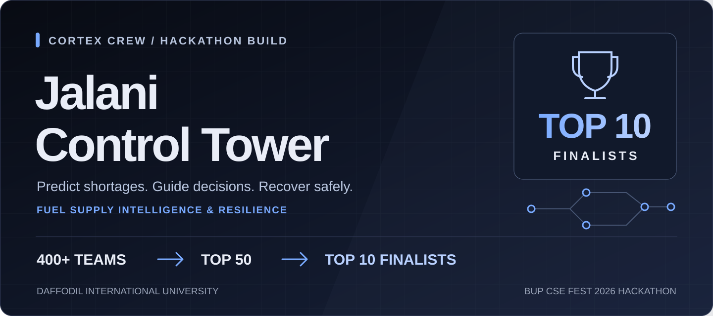
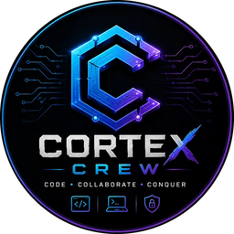
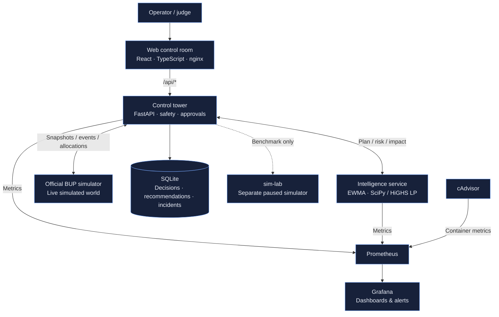

<p align="center">
  
</p>

<div align="center">



# Jalani Control Tower

**Fuel supply intelligence. Human-guided decisions. Built for resilience.**

An operator-facing platform that observes a simulated fuel network, predicts shortages,
plans shipments, and keeps working when conditions change or services fail.

[](https://github.com/kawsher-hridoy/jalani-control-tower/actions/workflows/ci.yml)


[Achievement](#achievement) · [Features](#features) · [Architecture](#architecture) · [Results](#results) · [Quick Start](#getting-started) · [Meet the Team](#team)

[**Visit Cortex Crew ↗**](https://cortexcrew.vercel.app/)

</div>

> **Simulation only.** Jalani operates exclusively against the organizer-provided BUP Fuel Supply Simulator. It does not connect to, monitor, or control real fuel infrastructure, vehicles, or pipelines.

## Achievement

### 🏆 Top 10 Finalist — BUP CSE Fest 2026 Hackathon

**Cortex Crew**, representing **Daffodil International University (DIU)**, qualified for the
**Top 10 Finalists from 400+ teams**, progressing through three selection stages:

| Starting field | First selection | Finalist selection |
|:---:|:---:|:---:|
| **400+ teams** | **Top 50** | **Top 10 Finalists** |

Jalani Control Tower was our build for the **Fuel Supply Intelligence & Resilience Platform**
challenge: bring application development, decision intelligence, and operational reliability
together in one working system.

## Overview

### The problem: fuel in the network is not fuel at the station

A station can run empty while a depot still has stock. Demand spikes, blocked routes,
limited dispatch capacity, and poorly timed deliveries make the allocation problem harder.
The simulator also exposes three costly failure cases:

- **Depot overflow:** incoming supply is discarded when the depot has no storage room.
- **Station overflow:** fuel is discarded if a delivery exceeds the tank's capacity on arrival.
- **Failed departures:** a shipment departing as a route closes can fail without a fuel refund.

In the recorded three-day baseline replay, taking no action served only **30.7% of demand**
and lost **73,000 L** to depot overflow. Jalani turns these risks into visible,
reviewable decisions rather than leaving operators to react after a stockout.
See the [benchmark report](docs/benchmark-report.md) for the measurement protocol.

### The solution: a closed loop from observation to recovery

**Observe → Detect → Predict → Decide → Simulate → Act → Monitor → Recover**

| Stage | What Jalani does |
|---|---|
| **Observe & detect** | Read and validate simulator state; track shortages, disruptions, demand changes, and incidents. |
| **Predict & decide** | Forecast demand with EWMA and an hour-of-day prior; use a rolling-horizon linear program to plan shipments. |
| **Simulate & act** | Estimate a plan's impact, request human approval where required, and revalidate shipments before execution. |
| **Monitor & recover** | Surface domain and service health; use fallback planning, degraded operation, and safe hold when failures occur. |

## Features

| Capability | What it brings to the operator |
|---|---|
| **Live control room** | KPI strip, station/depot inventory cards, route table, stockout risk board, incidents, decision history, and system health. |
| **Decision intelligence** | A 24-hour stockout-risk view and a 12-hour shipment-planning horizon at the default 15-minute tick length. |
| **Human-in-the-loop control** | Advisory, Supervised, and Autopilot modes; recommendation explanations, confidence, approval deadlines, and revision checks. |
| **Shipment safeguards** | Current and arrival tank-capacity checks, depot and dispatch budgets, route checks, deterministic idempotency keys, and lost-response reconciliation. |
| **Graceful degradation** | Local heuristic planning when intelligence is unavailable; polling continues when the event stream disconnects. |
| **Game Day drills** | Inject simulated demand spikes, route cuts, outages, and service faults to inspect the response and recovery. |
| **Operational visibility** | Prometheus metrics, a provisioned Grafana dashboard, alert rules, and container resource monitoring with cAdvisor. |
| **Reproducible evaluation** | A separate paused simulator for policy comparisons, k6 load-test scripts, and GitHub Actions for lint, tests, and builds. |

**Why this design matters:** the planner is not trusted on its own. Execution checks,
operator approval, fallback behavior, and visible failure reporting sit around the decision
engine so an attractive recommendation is not mistaken for a safe action.

## Architecture



- **Backend owns simulator writes.** A single uvicorn worker runs the control loop and executor;
  SQLite records recommendations, decisions, and incidents.
- **Intelligence is a separate, stateless service.** If it fails, the backend can use its local
  `heuristic-v1` policy instead of depending on a successful optimizer call.
- **The official simulator is unmodified.** Integration is HTTP-only. `sim-lab` is isolated
  from the live world and used for benchmark replays.

### Technology stack

| Layer | Technologies |
|---|---|
| Application | React, TypeScript, Vite, Tailwind CSS, TanStack Query, nginx |
| Backend | Python, FastAPI, Pydantic, HTTPX, SQLite |
| Intelligence | EWMA forecasting, SciPy / HiGHS linear programming |
| Observability | Prometheus, Grafana, cAdvisor |
| Delivery & evaluation | Docker Compose, GitHub Actions, pytest, Ruff, k6 |

The decision engine uses forecasting and mathematical optimization, **not reinforcement
learning**. Recommendation explanations currently use deterministic templates; Azure OpenAI
configuration exists, but an API-call integration is not implemented.

Explore the [detailed architecture](docs/architecture.md) for control-loop and lifecycle diagrams.

## Results

### Recorded policy benchmarks

**Recorded September 29, 2026:** each policy was replayed on `sim-lab` with seed `12345`,
**288 ticks / three simulated days**, and 15-minute ticks. The crisis replay injected a Dhaka
demand spike, a Gazipur–Tongi route cut, and delayed Gazipur diesel supply at their start ticks.

| Scenario | Policy | Demand served | Fuel lost | Allocations |
|---|---|---:|---:|---:|
| Baseline | No action | 30.7% | 73,000 L | 0 |
| Baseline | Heuristic | 100.0% | 0 L | 92 |
| Baseline | **LP + safety gate** | **100.0%** | **0 L** | 84 |
| Crisis | No action | 29.5% | 73,000 L | 0 |
| Crisis | Heuristic | 100.0% | 0 L | 96 |
| Crisis | **LP + safety gate** | **100.0%** | **0 L** | 89 |

> **How to read these results:** benchmark actions were auto-executed without an approval step.
> They are not measurements of the supervised operator workflow or guarantees of real-world
> performance. Both active policies served all demand in these runs; the data does not establish
> LP optimality. The LP rows used **82 baseline / 87 crisis urgent-cell safety-gate interventions**.
> The benchmark container reported `git_sha: dev`, so these runs do not establish deployed commit identity.

### Recorded dashboard load test

| Metric | Recorded result |
|---|---|
| Peak virtual users | 200 |
| Throughput | 134.53 requests/s |
| Request failure rate | 0.92% — passed the < 1% threshold |
| p95 response latency | **1019.70 ms — failed the < 300 ms threshold** |
| Overall thresholds | **Not passed** |
| Separate decision-path test | Not run |

### Evidence and how to read it

Measured simulator outcomes, projected stockout risk, and benchmark counterfactuals are different
kinds of evidence. Projected impact is a **model estimate**, not an observed outcome.

[Full benchmark protocol and results](docs/benchmark-report.md) · [Load-test workload and results](docs/loadtest-report.md)

## Getting Started

### Run locally

**Prerequisites:** Git, Docker Engine with the Compose plugin, available host ports, and access
to pull the official simulator and monitoring images. Python and Node.js run inside the containers.

```bash
git clone https://github.com/kawsher-hridoy/jalani-control-tower.git
cd jalani-control-tower
cp .env.example .env

# Edit .env before starting:
# - Replace OPERATOR_TOKEN, ADMIN_TOKEN, and GRAFANA_ADMIN_PASSWORD.
# - For local-only access, set WEB_PORT=127.0.0.1:8080
#   and GRAFANA_PORT=127.0.0.1:3000.
# - If port 3000 is occupied, use GRAFANA_PORT=127.0.0.1:3001.

docker compose config -q
docker compose up -d --build
docker compose ps
```

| Service | Local address with the default port numbers |
|---|---|
| Control room | [localhost:8080](http://localhost:8080) |
| Grafana | [localhost:3000](http://localhost:3000) — use `3001` if configured above |
| Prometheus | [localhost:9090](http://localhost:9090) |
| Official simulator console | [localhost:8000/admin](http://localhost:8000/admin) |
| Backend status | [localhost:8081/api/status](http://localhost:8081/api/status) |

Open **Access** in the control room and enter the values you set in `.env` when you need
approval or administrative controls. The Cortex Crew website is a team showcase, not a hosted
Jalani demo; the instructions above launch your own local instance.

```bash
# Process liveness, then application readiness and operating state:
curl -fsS http://localhost:8080/healthz
curl -fsS http://localhost:8081/api/ready
curl -fsS http://localhost:8081/api/status
```

`/healthz` checks nginx only. `/api/ready` returns `503` until the application's readiness
checks pass; a successful web response alone does not establish a healthy control loop.

## Team

### Cortex Crew · Daffodil International University

The four-member Cortex Crew team for the **BUP CSE Fest 2026 Hackathon**:

| Team member | Role | Profiles |
|---|---|---|
| **Kawsher Hridoy** | **Team Leader** | [GitHub](https://github.com/kawsher-hridoy) · [LinkedIn](https://linkedin.com/in/kawsher-hridoy) |
| **Shafiur Rahman Shafim** | Team Member | [GitHub](https://github.com/Shafiur0) · [LinkedIn](https://www.linkedin.com/in/shafiur-rahman-shafim/) |
| **Arnob Kumar Paul** | Team Member | — |
| **Fahim Shariar** | Team Member | — |

[**Meet Cortex Crew on our team website →**](https://cortexcrew.vercel.app/)

## Documentation & Limitations

| Guide | Contents |
|---|---|
| [Architecture](docs/architecture.md) | Service boundaries, control loop, planning, resilience, and recommendation lifecycle. |
| [Benchmark report](docs/benchmark-report.md) | Same-seed protocol, baseline/crisis runs, safety-gate counters, and measurement limitations. |
| [Load-test report](docs/loadtest-report.md) | k6 workloads, latency, throughput, failures, and control-loop samples under load. |
| [Environment example](.env.example) | Supported configuration variables; credential placeholders must be replaced. |

### Known limitations

- **Immediate LP dispatch:** the optimizer can defer a feasible departure or emit less than the
  200 L action threshold. The targeted planner test is marked `xfail`. The backend safety gate
  covers urgent HIGH/CRITICAL cells using the backup rule; its interventions are counted and
  tagged `FALLBACK` for approval rules.
- **Performance:** the recorded dashboard p95 target failed. The decision-path workload,
  backend CPU, and backend memory were not measured in that load-test report.
- **Evaluation scope:** the recorded runs cover three simulated days and one seed; they do not
  validate longer-term rationing behavior or the performance of a supervised operator team.
- **Route-cut races:** cancellation is best effort while the simulator runs. A failed shipment
  is reported as fuel loss rather than hidden; a paused world allows a controlled guard drill.
- **Explanations & hosting:** explanations are template-based, and no verified public project
  demo is linked here. Configured Azure fields alone do not establish a working integration.

### Operator guide

<details>
<summary><strong>Access, autonomy modes, approval rules, and recommendation lifecycle</strong></summary>

The **operator token** approves/rejects recommendations. The **admin token** also permits mode
changes and Game Day actions. Enter them through **Access**; never publish them in screenshots,
issues, or documentation.

A recommendation may carry several conditions. **The most restrictive requirement wins.**

| Condition | Meaning |
|---|---|
| `CROSS_REGION` | The source depot and destination station are in different regions. |
| `FALLBACK` | The recommendation uses the backup heuristic, including an urgent-cell LP safety-gate action. |
| `LOW_CONFIDENCE` | Forecast confidence is LOW, or the underlying data is stale. |
| `RATIONING` | No pending outside supply remains within the planning horizon and projected unmet demand remains. |

| Autonomy mode | Runs automatically | Requires human approval |
|---|---|---|
| **Advisory** | Nothing. | Every recommendation. |
| **Supervised** — default | Recommendations with no conditions; FALLBACK-only recommendations that are CRITICAL and within-region. | CROSS_REGION, RATIONING, LOW_CONFIDENCE, and other FALLBACK cases. |
| **Autopilot** | Recommendations without RATIONING or LOW_CONFIDENCE. | RATIONING and LOW_CONFIDENCE, always. |

Operating mode adds another restriction: **SAFE_HOLD blocks shipment dispatch and approval execution**. In
**DEGRADED**, only CRITICAL, within-region recommendations with no condition other than an
optional FALLBACK may auto-execute, subject to the autonomy table. Human-approved actions
still pass execution checks; DEGRADED does not bypass revalidation. SAFE_HOLD is a shipment
safety mode, not a blanket lock on Game Day administrative controls or guard cancellations.

Review the explanation, projected effect, confidence, and **deadline tick** before approving.
Approvals include the recommendation's `revision`: an outdated revision returns
`409 REVISION_CHANGED`. A materially changed plan after revalidation can return
`409 REVALIDATION_CHANGED`; inspect the updated recommendation. Overdue recommendations
expire automatically.

</details>

<details>
<summary><strong>Controlled demo walkthrough</strong></summary>

Use `SIMULATION_SPEED=1` for a walkthrough. Reset only an instance you own: **Reset world**
discards the current simulated world. Do not reset another operator's session.

1. Open Game Day → **Reset world**, then **Pause**.
2. Advance with **Step N**, or run briefly and pause again.
3. Explain the inventory cards, routes, risk board, and recommendations while simulated time is frozen.
4. Inject the Dhaka demand-spike preset and inspect the updated recommendations; advance in small steps as needed.
5. Review and approve a cross-region recommendation while paused. Tick-based deadlines do not advance during the explanation.
6. Inject the Tongi route-cut preset, inspect cancellations/incidents, and disable intelligence to show fallback behavior.
7. Re-enable intelligence, clear faults, and finish with Grafana and the recorded evaluation reports.

Pausing freezes simulated time, **not every backend action**: the guard and refresh can still
run, and an explicit operator approval can create an allocation while paused.

</details>

<details>
<summary><strong>Configuration reference</strong></summary>

Use [.env.example](.env.example) as the starting point. Values are read at startup;
recreate affected containers after changing `.env`. Credential defaults are placeholders,
not safe secrets.

| Variable | Shipped default | Purpose |
|---|---|---|
| `SIMULATION_SPEED` | `2` | Ticks per wall-clock second; use `1` for a controlled demo. |
| `TICK_MINUTES` | `15` | Simulated minutes per tick. |
| `SIMULATOR_START_MODE` | `running` | Live simulator starts running or paused; `sim-lab` always starts paused in Compose. |
| `AUTONOMY_MODE` | `SUPERVISED` | `ADVISORY`, `SUPERVISED`, or `AUTOPILOT`. |
| `PLAN_HORIZON_TICKS` | `48` | LP horizon: 12 hours at 15-minute ticks; risk is separately projected over 24 hours. |
| `SAFETY_Z` | `1.28` | Safety-stock parameter for demand uncertainty. |
| `CONSTRAINED_FACTOR` | `0.5` | Dispatch multiplier for a depot marked CONSTRAINED. |
| `OPERATOR_TOKEN` / `ADMIN_TOKEN` | `change-me-operator` / `change-me-admin` | Replace both; used in `X-Operator-Token` / `X-Admin-Token` request headers. |
| `GRAFANA_ADMIN_PASSWORD` | `change-me` | Replace the Grafana admin password. |
| `WEB_PORT` / `GRAFANA_PORT` | `8080` / `3000` | Compose binds these on all interfaces unless a host address is included; use `127.0.0.1:PORT` for local-only access. |
| `BACKEND_PORT` / `SIM_PORT` / `SIM_LAB_PORT` / `PROMETHEUS_PORT` | `8081` / `8000` / `8001` / `9090` | Port numbers; Compose binds these services to loopback. |
| `GIT_SHA` | `dev` | Build identifier displayed by the UI and status API; set it deliberately when identifying a deployment. |
| `AZURE_OPENAI_ENDPOINT` / `AZURE_OPENAI_API_KEY` / `AZURE_OPENAI_DEPLOYMENT` | Empty | Configuration scaffolding only; explanation API calls are not implemented. |
| `AZURE_OPENAI_API_VERSION` | `2024-10-21` | Retained configuration value; does not activate an integration. |

The forecast starts with an organizer-documented hour-of-day demand prior and learns from live
observations. Observed demand is normalized by the multiplier active at that time, then scaled
by expected future multipliers. The constrained-depot dispatch factor is a modeling assumption.

</details>

<details>
<summary><strong>Resilience and observability reference</strong></summary>

These are designed responses to fault injections, not latency guarantees.

| Injection / condition | Expected response |
|---|---|
| Simulator unavailable | Circuit breaker and SAFE_HOLD; shipment dispatch is held until recovery. |
| Intermittent error responses | Bounded retries for GETs, allocation POSTs, and allocation cancellations, reusing action identity. Events, faults, steps, and resets are not retried. |
| Added latency | DEGRADED when observed p95 exceeds 1 s; 1500 ms is below configured GET/POST timeouts. At 2500 ms, GETs exceed their 2 s timeout and repeated failures can open the breaker. POST timeout is 3 s. |
| Stale data | DEGRADED plus STALE_DATA; affected recommendations carry LOW_CONFIDENCE. |
| Event stream disconnected | STREAM_DOWN on reconnect failure; polling continues. An already-open stream may remain connected. |
| Intelligence unavailable | FALLBACK_POLICY after two consecutive failures; re-probe every 5 s and return to LP after two successful calls. |
| Route cut | Cancel observed PENDING shipments where possible; record any lost race and associated fuel loss. |
| Demand spike | Open a demand incident and adjust forecasting without double-applying the multiplier. |
| Invalid data / simulator reset | Reject invalid snapshots; retain the last good state. A reset triggers a new epoch and state reload. |

Prometheus scrapes backend, intelligence, and cAdvisor every **5 seconds**. The provisioned
Grafana dashboard groups **Operations**, **Decisions & intelligence**, **Service health**,
**Infrastructure**, and **Load test** panels. Metrics include service level, unmet demand,
fuel loss, estimated stockout risk, approvals, fallback usage, forecast quality, solve time,
HTTP latency, circuit state, tick lag, and container resource use.

Alert rules cover SAFE_HOLD, DEGRADED, fallback usage, stale data, critical stockout risk,
fuel loss, high error rate, high latency, circuit opening, and a lagging control loop.

</details>

<details>
<summary><strong>Development and evaluation commands</strong></summary>

Run from the repository root. Local Python tests require Python 3.12 and `uv`; application
startup itself uses Docker. GitHub Actions runs backend/intelligence lint and tests, the web
build, Compose validation, and application image builds.

```bash
make test                 # Backend and intelligence pytest suites
make logs                 # Follow service logs
make benchmark            # Baseline replay on sim-lab
make benchmark-crisis     # Crisis replay on sim-lab
make loadtest             # k6 dashboard read workload
make loadtest-decision    # k6 planning-preview workload
```

Benchmarks reset **sim-lab**; never point them at the shared live world. Load tests drive your
running stack and can affect responsiveness. A script being available does not mean its
workload was measured—the recorded decision-path test was not run.

To stop without removing persistent data:

```bash
docker compose down
```

Do not use `make clean` or `docker compose down -v` if you need to retain data; they remove
named volumes.

</details>

<details>
<summary><strong>Public deployment precautions</strong></summary>

This is deployment guidance, **not evidence of a currently running public deployment**.

- Replace operator/admin tokens and the Grafana password. `/api/status` checks placeholder
  operator/admin tokens through `insecure_defaults`; it does **not** check the Grafana password.
- Keep backend, both simulators, and Prometheus on loopback. Set the web/Grafana bindings to
  loopback when placing them behind an HTTPS reverse proxy.
- Expose only intended entry points through the cloud firewall and proxy. Grafana's shipped
  configuration enables anonymous **Viewer** access; review that before exposing it.
- Do not send control tokens over public HTTP. Verify HTTPS, application readiness, and status
  externally before sharing a demo address.
- Do not rely on UFW alone for Docker-published ports. Bind private ports deliberately and
  keep simulator consoles and monitoring internals off the public network.
- Preserve `jalani-data` and `prometheus-data` on updates; do not remove volumes unintentionally.

</details>

### Acknowledgements

Built for the **BUP CSE Fest 2026 Hackathon**, organized by the **BUP Computer Programming Club**
in association with **Poridhi.io**. The operational world is supplied by the official
`asifmahmoud414/bup-fuel-supply-simulator:1.0.0` image; Cortex Crew built the control tower around it.

Team identity and linked profiles: [Cortex Crew](https://cortexcrew.vercel.app/).

---

<div align="center">

**Cortex Crew · Daffodil International University**

**400+ teams → Top 50 → Top 10 Finalists 🏆**

[Back to top ↑](#jalani-control-tower)

</div>
