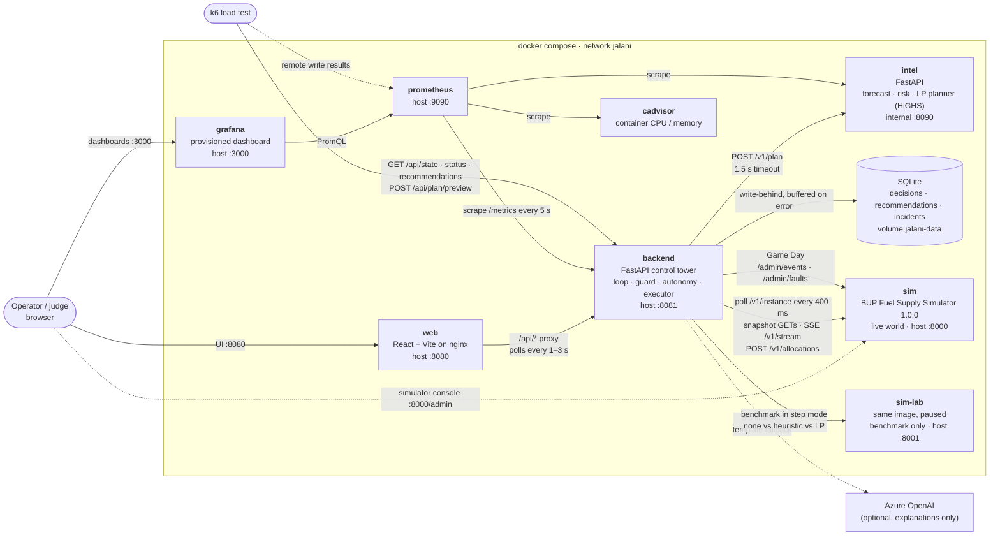
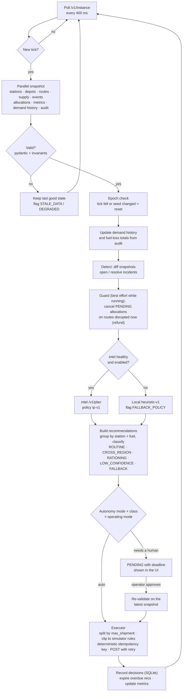
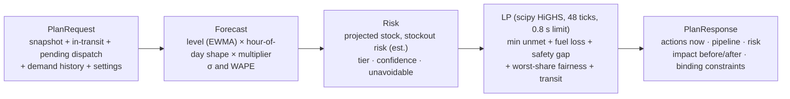
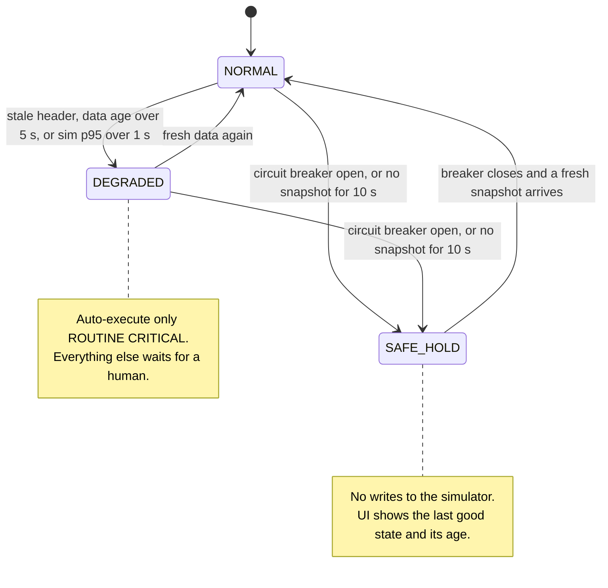
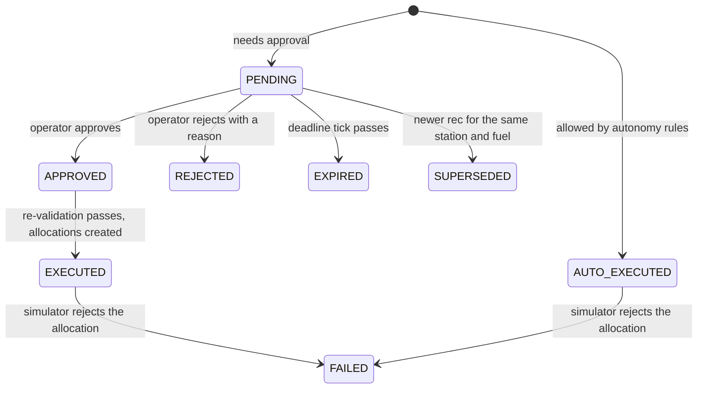

# Architecture

Jalani Control Tower is an operations center that sits on top of the BUP Fuel Supply Simulator.
It watches the simulated network, predicts stockouts, plans shipments, and executes them, with a human
approving the consequential decisions. It talks to the simulator only over HTTP and never modifies it.

> SIMULATION: not real fuel infrastructure.

## 1. System view

Everything runs from one `docker compose up -d --build` on the `jalani` network.

| Service | Role | Exposed to the host |
|---|---|---|
| `web` | One-page control room; nginx serves the SPA and proxies `/api/` to the backend | :8080 |
| `backend` | Owns the control loop, all simulator writes, approvals, incidents and metrics | :8081 (keep closed on a VPS) |
| `intel` | Stateless decision engine: forecast, stockout risk, LP plan | none |
| `sim` | The organizer's simulator, the live world being operated | :8000 |
| `sim-lab` | A second simulator, paused, used only by the benchmark | :8001 (keep closed on a VPS) |
| `prometheus`, `grafana`, `cadvisor` | Metrics, dashboards, container resource usage | :9090, :3000 |

## 2. Control loop (one pass per simulator tick)

## 3. Decision engine (intel)

The LP respects the simulator rules the backend measured (lead time = transit, no shipping on routes
disrupted at departure, station and depot capacity, dispatch capacity per departure tick), so its
actions are valid before the executor clips them again.

Two different horizons are in play: **stockout risk is projected 24 h ahead**, but the **LP only
plans and commits 12 h (48 ticks) ahead** within that wider view — a longer look at the danger, a
shorter one for what it actually ships. Fairness (the "worst-share" term above) enters the
objective only as a **tie-breaker**, after unmet demand and fuel loss are already minimized — it
never trades either of those away to even out the split. The backend itself runs as a single
uvicorn worker, so exactly one control loop instance ever writes a shipment; there is no multi-worker
race to guard against.

## 4. Operating modes (resilience)

`FALLBACK_POLICY` is a flag, not a mode: it is set when intel fails twice in a row (or is switched off in
Game Day, re-probed every 5 s), and clears after two consecutive successful intel calls. It can be combined with any mode.

| Simulator fault | How it is detected | What the control tower does |
|---|---|---|
| `unavailable` | Consecutive failures open the circuit breaker | SAFE_HOLD, no writes, recovers automatically |
| `error_rate` | Fault responses counted per endpoint | Retries with jitter and the **same** idempotency key, so no duplicate shipments |
| `latency` 1500 ms | Simulator p95 > 1 s, still under both timeouts | DEGRADED; the circuit breaker does **not** trip |
| `latency` 2500 ms | Exceeds the 2 s GET / 3 s POST timeouts | Circuit breaker OPENs → SAFE_HOLD |
| `stale_data` | `X-Simulator-Stale` header | DEGRADED + `STALE_DATA`; also adds `LOW_CONFIDENCE` to affected recommendations |
| `stream_disconnect` | New SSE connections rejected | `STREAM_DOWN` on the next reconnect attempt; polling keeps processing ticks (an already-open stream may stay up) |
| intel down | `/v1/plan` fails twice in a row, or disabled via Game Day | `FALLBACK_POLICY`; re-probed every 5 s, returns to `lp-v1` after 2 consecutive successes |

## 5. Recommendation lifecycle (human in the loop)

See the README, §7 "Operator guide", for the one authoritative table: conditions
(`CROSS_REGION` / `FALLBACK` / `LOW_CONFIDENCE` / `RATIONING`) evaluated per recommendation, the
autonomy mode × condition matrix, and how SAFE_HOLD/DEGRADED narrow it further. A recommendation
also carries a `revision`; approving one whose revision has since moved on returns
`409 REVISION_CHANGED` rather than executing a plan the operator never actually saw.

Every approval, rejection, expiry, mode change, Game Day action and policy fallback is written to the
decision history with its actor (`auto`, `operator:<name>` or `system`).
